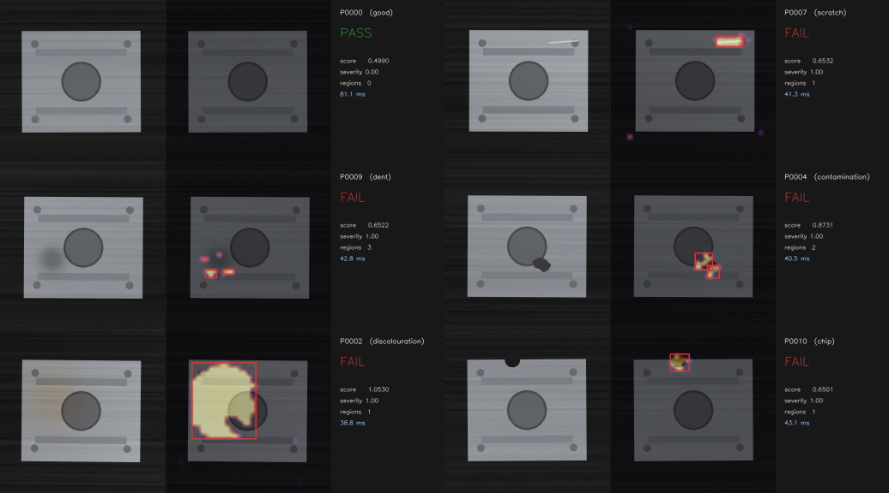

# NIRIKSHAK — निरीक्षक

**Zero-shot visual quality inspection on Snapdragon.**
An HP Snapdragon PC and an Arduino UNO Q become a factory inspection cell that learns a new part from ~20 good samples. No labels. No training. No cloud.

**Jash Pasad** · B.Tech, Indian Institute of Technology Gandhinagar
Submitted to the **Snapdragon® AI Lab Build & Present Challenge** (Qualcomm × HP × Arduino, India).

---

## The problem, stated precisely

India has roughly 6.3 crore MSMEs. Almost none of them do automated visual inspection, and the reason is not that they don't want it.

**Machine vision cells cost ₹15–40 lakh** per line (Cognex, Keyence, Omron). That is more than the annual profit of most units that would benefit from one.

**Supervised defect detection needs data that does not exist.** The standard AI answer — train a detector on labelled defects — assumes thousands of labelled defect images. A workshop producing 400 parts a day with a 2% reject rate generates *eight* defective parts a day, unlabelled, across defect types nobody has enumerated. It will take three years to collect a training set, and the model still cannot detect a defect type it has never seen. In manufacturing, the defect you have never seen is the one that reaches the customer.

**Cloud inference does not fix it.** Three reasons, in increasing order of how badly they bite:
1. Line rate. A conveyor does not wait 300 ms for a round trip.
2. Connectivity. Shop floors in Rajkot, Ludhiana and Coimbatore do not have reliable uplinks, and a QC system that stops when the internet does is not a QC system.
3. Contract manufacturing. A job shop making parts for someone else is usually contractually barred from uploading images of those parts anywhere. The part geometry *is* the customer's IP.

So the market is stuck between "₹40 lakh" and "nothing," and picks nothing.

## The reframe

> A defect is not a thing you learn to recognise.
> A defect is a region that does not look like anything you saw on a good part.

Model **normality**, not defects. Every factory already has the training data for that — it is the parts they ship. Twenty of them is enough.

This inverts every constraint above. No labels, because good parts need none. No defect dataset, because we never model defects. Unknown defect types are caught by construction, because anything unlike normal is anomalous. And the whole thing fits on a laptop.

## The systems idea: compute proportional to uncertainty

The naive build runs a vision-language model on every part. On a Snapdragon X2 Elite that is ~400 ms/part, which caps the line at ~2.5 parts/second, pins the NPU at full draw all shift, and generates paragraphs of prose about 950 parts that were perfectly fine.

NIRIKSHAK spends compute in proportion to how uncertain it is:

| Tier | Runs on | Cost | Fires on |
|---|---|---|---|
| **0 · Gate** | Arduino UNO Q (Dragonwing QRB2210) | ~2 ms | every camera frame |
| **1 · Screen** | Hexagon NPU | ~10 ms | every part |
| **2 · Explain** | Hexagon NPU (Qwen3-VL-4B) | ~400 ms | only the uncertainty band |
| **3 · Reason** | Hexagon NPU (Qwen3-4B) | ~25 s | once per shift |

At a realistic 97% yield, Tier 2 fires on ~4% of parts. Mean cost per part is `10 + 0.04 × 400 ≈ 26 ms`, not 400 ms.

**That is a 6× throughput gain obtained purely by ordering the models, without making any single model faster.** It is the difference between a laptop that keeps up with a conveyor and one that does not.

Two properties of this design matter as much as the speed:

- **The generative model never decides.** Tier 1's calibrated distance decides PASS/REVIEW/FAIL. Tier 2 supplies vocabulary for the operator. Letting an LLM adjudicate a physical accept/reject would be indefensible on an audited line, so we don't.
- **The escalation policy is a rule, not a model.** On an audited line, "why was this part escalated?" must have an answer you can read. See `CascadePolicy` in `nirikshak/pipeline.py`.

---

## Results

Reproduce everything below with two commands (see [Quickstart](#quickstart)).

### Detection — synthetic benchmark, 24 enrolment samples

| Defect type | n | AUROC | caught | escaped | localised |
|---|---|---|---|---|---|
| scratch | 8 | 1.000 | 8 | 0 | 8 |
| dent | 8 | 1.000 | 8 | 0 | 8 |
| chip | 8 | 1.000 | 8 | 0 | 8 |
| contamination | 8 | 1.000 | 8 | 0 | 8 |
| discolouration | 8 | 1.000 | 8 | 0 | 8 |
| **overall** | **40** | **1.000** | **40** | **0** | **40** |

Escape rate 0%. False reject rate 0/40. Enrolment: **5.3 s**.

> ### ⚠️ Read this before quoting those numbers
>
> **AUROC 1.000 on synthetic data mostly tells you the synthetic data is easier than reality.** We generated it, so we do not get to be impressed by it. It is here to prove the pipeline is correct and reproducible on any machine, not to claim field accuracy.
>
> What makes the number *non-trivial* is that the generator injects the nuisance variation that normally defeats this class of method: a randomised lighting gradient, ±4 px translation, ±1.4° rotation, sensor noise, and a brushed-metal finish whose parallel streaks look exactly like scratches. Without that, any detector separates a defect from a pixel-identical template and the benchmark is a lie.
>
> The honest external reference is **MVTec AD**, the standard public benchmark, where published PatchCore-class methods reach ~0.99 image AUROC. `scripts/evaluate.py` accepts MVTec's directory layout unchanged. See [docs/BENCHMARKS.md](docs/BENCHMARKS.md).

The evaluator also reports the **threshold safety window** — the range of sigma values that give simultaneously zero escapes and zero false rejects. On this dataset it is `[0.78, 2.06]` and we ship 1.50, i.e. the centre, not a value tuned to the edge of a cliff.

### Cascade economics

Measured Tier-1 latency, modelled against a 400 ms Tier-2:

| Line yield | Escalation rate | Effective ms/part | Parts/min | vs VLM-on-everything |
|---|---|---|---|---|
| 90% | 10.9% | 95.6 | 627 | 4.2× |
| 95% | 6.0% | 75.8 | 791 | 5.3× |
| 97% | 4.0% | 67.9 | 883 | 5.9× |
| 99% | 2.0% | 60.0 | 1000 | 6.7× |

### What the operator sees



*Left to right per panel: input, anomaly heatmap with localised regions, verdict. The system was shown only good parts.*

---

## What we changed, and what it cost us to find out

Four things moved the numbers more than everything else combined. Each was found by measurement, and each is documented at the code that implements it. We list them because the failures are more informative than the final configuration.

**1. Whitening the descriptors — AUROC 0.711 → 0.944.**
Raw descriptors mix quantities with wildly different natural scales: a histogram bin in [0,1], a chromaticity mean near 0.33, a Laplacian p95 near 0.02. Euclidean distance over that is decided by whichever group happens to have the largest variance — an accident of units, not a statement about defects. Z-scoring each dimension against the enrolment set fixed it. `memory_bank.py :: Whitener`

**2. Overlapping patches — scratch recall 38% → 100%.**
With non-overlapping tiles, a scratch crossing a tile boundary is diluted into two patches and detected in neither. Halving the stride costs 4× the patches and is worth every one. `embedder.py :: _blockify`

**3. Two background kernels — dent recall 88% → 100%.**
A single local-background width can only see defects smaller than itself. A 40 px dent inside a 65 px background window is absorbed into its own background and disappears. Carrying 65 px and 161 px covers both regimes. `embedder.py :: bg_kernels`

**4. A calibration bug that caused a 57% escape rate.**
Leave-one-out folds were building half-size coresets. A bank with half the entries has larger nearest-neighbour gaps, so every fold distance was inflated, so the thresholds were placed too high, so real defects passed. AUROC was 0.94 the whole time — **the detector was fine and the thresholds were broken**, which is exactly the failure that a separability metric cannot see. `memory_bank.py :: calibrate`

Also worth recording: replacing the per-fold coreset rebuild with origin-masking took enrolment from **92.7 s to 5.3 s**. Ninety seconds is a long time to stand at a machine holding a part.

---

## Quickstart

```bash
git clone https://github.com/jashpasad/NIRIKSHAK.git && cd NIRIKSHAK
pip install -r requirements.txt

python scripts/make_demo_data.py          # synthesise a part + 5 defect types
python scripts/demo.py                    # enrol, inspect, report
```

Runs on any machine — Windows, Linux, macOS, x86 or ARM. Tiers 2 and 3 detect that GenieX is absent and degrade to a deterministic statistical report rather than failing.

Evaluate and benchmark:

```bash
python scripts/evaluate.py  --data data/demo     # AUROC, escapes, threshold window
python scripts/benchmark.py --iters 200          # latency and cascade economics
pytest                                            # 11 behavioural tests
```

CLI:

```bash
nirikshak enrol   ./good_parts -o bracket.npz     # ~20 images, no labels
nirikshak inspect bracket.npz part.jpg --heatmap out.png
```

`inspect` exits non-zero on a non-PASS verdict, so it drops into a shell pipeline without parsing JSON.

### On Snapdragon

```bash
pip install -r requirements-snapdragon.txt
python scripts/fetch_backbone.py --device x2-elite --out models/
nirikshak --backbone models/backbone.onnx --context-cache models/ctx.bin \
          enrol ./good_parts -o bracket.npz
```

`--context-cache` turns a ~20 s cold graph finalisation into a sub-second warm start, which matters when an operator power-cycles the cell every shift. Full setup, including the x64/ARM64 Python split that trips up most people, is in [docs/DEPLOYMENT.md](docs/DEPLOYMENT.md).

---

## Architecture

```
                    ┌──────────────────────────────────────────┐
   camera ─────────▶│  TIER 0 · GATE      Arduino UNO Q         │
                    │  Dragonwing QRB2210 · Debian              │
                    │  frame diff + sharpness      ~2 ms        │
                    │  STM32U585 (Zephyr): diverter timing      │
                    └──────────────────┬───────────────────────┘
                          part present │  JPEG over factory LAN
                                       ▼
   ┌───────────────────────────────────────────────────────────────┐
   │  HP Snapdragon PC · Hexagon NPU                               │
   │                                                               │
   │   TIER 1 · SCREEN            every part          ~10 ms       │
   │   CNN backbone → patch descriptors → whiten                   │
   │   → k-NN vs coreset memory bank → score + heatmap             │
   │                                                               │
   │        PASS ──────────────────────────────────▶ accept        │
   │        REVIEW / FAIL                                          │
   │             │                                                 │
   │             ▼                                                 │
   │   TIER 2 · EXPLAIN           ~4% of parts        ~400 ms      │
   │   Qwen3-VL-4B on the Tier-1 crop → typed JSON defect record   │
   │                                                               │
   │   TIER 3 · REASON            once per shift      ~25 s        │
   │   numpy drift detection → Qwen3-4B → shift report             │
   └───────────────────────────────────────────────────────────────┘
```

Full design rationale in [docs/ARCHITECTURE.md](docs/ARCHITECTURE.md).

### Why the UNO Q is in this system

A camera at 30 fps produces 108,000 frames an hour. A line at 40 parts/min produces 2,400 parts. Screening frames instead of parts would waste 97% of the NPU's work on empty conveyor. **The gate converts a video problem into a parts problem.**

It runs frame differencing, not a neural network — deliberately. A model there would need its own enrolment, its own failure modes and its own explanation to the operator, to answer a question that background subtraction answers correctly in 2 ms.

And the reject actuation lives on the STM32U585, not on Linux. A reject decision arriving 30 ms late has diverted the wrong part, and 30 ms of scheduling jitter is an ordinary Tuesday for a Linux userspace process. Determinism belongs on the Cortex-M33 — which is precisely why the UNO Q has one.

### Why on-device is a requirement, not a preference

| | Cloud | NIRIKSHAK |
|---|---|---|
| Latency | 200–500 ms + uplink | ~10 ms, deterministic |
| No connectivity | stops | unaffected |
| Part geometry (customer IP) | leaves the building | never leaves the device |
| Marginal cost per part | per-call API fee | electricity |
| Shift report, 11 lines × 365 days | ~120,000 LLM calls/yr | ₹0 |

That last row is why per-shift analysis does not exist in these plants today. It is not that nobody wants it — it is that nobody will approve the recurring bill. On the NPU it runs every shift on every line and nobody has to justify it.

---

## Repository layout

```
nirikshak/
  runtime/backend.py        QNN EP → Hexagon, with honest fallback reporting
  tier1_screen/
    embedder.py             patch descriptors: NPU backbone + reference impl
    memory_bank.py          whitening, greedy k-center coreset, calibration
    detector.py             enrol / inspect / heatmap / region extraction
  tier2_explain/vlm.py      GenieX VLM, gated, constrained JSON output
  tier3_reason/shift_report.py  drift detection (numpy) + narrative (LLM)
  edge/
    uno_q_agent.py          Tier-0 gate, runs on the UNO Q Debian side
    sketch/gate.ino         STM32U585 diverter and stack-lamp control
    protocol.py             newline-JSON + JPEG over TCP. No broker, no cloud.
  pipeline.py               the cascade and its escalation policy
scripts/
  make_demo_data.py         synthetic parts with realistic nuisance variation
  demo.py                   end-to-end run, renders figures
  evaluate.py               AUROC, escapes, false rejects, threshold window
  benchmark.py              latency and cascade economics
  fetch_backbone.py         export + profile a backbone on real Snapdragon silicon
tests/                      11 behavioural tests
```

## Design decisions worth arguing about

**A recipe is one file.** `bracket.npz` is ~320 KB and an operator copies it to the next cell on a USB stick. No account, no sync, no licence server. That is a deliberate product decision for this market, not an oversight.

**Two thresholds, not one.** Between PASS and FAIL is REVIEW, and REVIEW is what Tier 2 exists to resolve. A single threshold forces every borderline part into a hard accept/reject the data does not support.

**Biased toward REVIEW over FAIL.** On an MSME line a false reject costs a good part and, far more expensively, the operator's trust. An operator who stops believing the machine switches it off, and then it detects nothing.

**Drift is measured on *passing* parts.** If the mean anomaly score of parts that are still passing is climbing, the process is moving toward the reject threshold before it produces any scrap. That is a leading indicator, and it is arithmetic — so we compute it in numpy and hand the model the result, rather than asking a language model to do statistics.

**The evaluator reports escapes and false rejects separately, and never collapses REVIEW into either.** A part in review has not been decided; it has been escalated. Papers that binarise this make the escape rate look better than it is.

## Limitations

Stated plainly, because a reviewer will find them anyway.

- **Synthetic validation.** MVTec AD numbers and a real camera trial are the next milestone. See the caveat box above.
- **The reference embedder is a floor, not the product.** It exists so this repo runs with zero downloads. The production path is the NPU backbone; the two are benchmarked separately and never mixed (loading a recipe with the wrong embedder raises rather than silently producing nonsense).
- **NPU latencies are the design target, not yet measured by us.** The ~10 ms and ~400 ms figures come from Qualcomm's published Snapdragon X2 Elite profiles. Our measured 52 ms Tier-1 number is the CPU reference descriptor on x86. Replacing modelled numbers with profiled ones on real silicon is the first task of the next round.
- **Registration assumed.** The positional feature assumes the part is roughly fixtured. A tumbling part on an unfixtured belt needs `pos_weight=0`, which costs some sensitivity.
- **Reflective and transparent parts are hard.** Specular highlights move with the part and read as anomalies. Polarised lighting is the standard fix and is a cell-design problem, not a software one.
- **Not a metrology tool.** This finds *departures from normal*. It does not measure a dimension to tolerance. If you need ±0.01 mm, you need a gauge.

## Author

**Jash Pasad** — B.Tech, Indian Institute of Technology Gandhinagar
Snapdragon® AI Lab Build & Present Challenge, 2026 · individual submission

## Licence

Apache-2.0. © 2026 Jash Pasad, IIT Gandhinagar. The synthetic data generator, evaluation harness and all reported numbers are in this repository so every claim above can be checked rather than believed.
